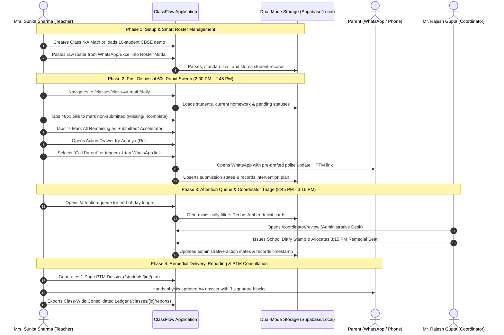

# ClassFlow — End-to-End Institutional Operational & Functional Specification
**Document Version:** 3.0 (Academic Year 2026–2027 • 2026 Modern Edition)  
**Author / Persona:** Institutional Client Representative (Primary Wing Administration & Academic Coordinator Committee)  
**Target Stakeholders:** School Management, Primary Section Coordinators, Class & Subject Teachers, Full-Stack AI/Human Engineering Teams  
**School Context:** Indian Primary School Wing (Classes 1 to 6, CBSE/ICSE Curriculum Framework)  
**Repository Working Directory:** [`f:/CU_Sudhanshu_File/SCSchool/Job Ready/Project/p`](file:///f:/CU_Sudhanshu_File/SCSchool/Job%20Ready/Project/p)

---

## Executive Summary & Client Mandate

As the **Client Representative** representing the School Principal, Primary Section Coordinator (**Mr. Rajesh Gupta**), and Senior Teaching Faculty (represented by **Mrs. Sunita Sharma**) of Delhi Public Model School, this document constitutes the **definitive, end-to-end operational and functional blueprint of ClassFlow**.

### The Core Problem ClassFlow Solves
In Indian primary education (Grades 1 through 6), teachers manage 30 to 45 students per section across multiple subjects (Mathematics, EVS, English, Hindi). Daily tracking of physical notebook exercises (homework, classwork, unit tests, mental math quizzes) has historically been trapped between two failed extremes:
1. **Paper Registers & Hand-Written Logs**: Prone to loss, untracked over time, and incapable of early-warning calculations.
2. **Bloated Legacy ERPs**: Desktop-only, designed for fee accountants, requiring 15–20 minutes of repetitive clicking per section, and locking roster changes behind IT support tickets.

Consequently:
* **Academic deficits compound silently** until terminal examinations or hostile Parent-Teacher Meetings (PTMs).
* **Staff room time is squandered**: Teachers spend 20–30 minutes per class manually tallying notebooks and cross-referencing student diaries.
* **Communication bottlenecks**: Teachers either hesitate to engage parents or spend excessive personal time drafting unstructured messages without audit trails.
* **Class roster rigidity**: Real-world schools frequently reshuffle sections, enroll mid-term admissions, or require subject-specific rosters that legacy ERPs freeze.

### The Core Product Promise
> **“At the end of every school day (between 2:30 PM and 3:15 PM), a primary teacher sitting in the staff room can log an entire classroom, initiate targeted interventions, and dispatch official communications in under 60–90 seconds per class.”**

---

## 1. Institutional Governance & The Dual-Operating Model

ClassFlow balances self-service teacher productivity with rigorous school governance through two synchronized operating modes:

```
┌────────────────────────────────────────────────────────────────────────────────────────┐
│                                   CLASSFLOW OPERATING PARADIGM                         │
├───────────────────────────────────────────┬────────────────────────────────────────────┤
│   MODE 1: TEACHER SELF-SERVICE SAAS       │   MODE 2: INSTITUTIONAL GOVERNANCE DESK   │
│   (Empowered Classroom Educator)          │   (Section Coordinator & School Board)     │
├───────────────────────────────────────────┼────────────────────────────────────────────┤
│ • Zero administrative bottlenecks         │ • Cross-grade oversight (Classes 1 to 6)   │
│ • Instant class creation & roster import  │ • Official School Diary Stamp approval     │
│ • 60-second rapid homework logging        │ • 3:15 PM Remedial Batch seat allocation   │
│ • 1-tap WhatsApp & phone parent updates   │ • Formal parent summons & PTM scheduling   │
│ • Self-directed student intervention plans│ • Whole-class consolidated compliance      │
└───────────────────────────────────────────┴────────────────────────────────────────────┘
```

### 1.1 The "Zero Classroom Phone" Rule
* **School Policy**: Teachers are strictly prohibited from using smartphones in classrooms during instructional periods.
* **Operational Reality**: ClassFlow is operated during the **post-dismissal staff room duty window (2:30 PM – 3:15 PM)**.
* **Mobile-First UX Mandate**: The application is optimized for mobile browsers and PWAs with:
  - Dynamic viewport containers (`100dvh`).
  - Fixed safe-area padding for modern device notches.
  - **Minimum 48px touch targets** (`touch-target-48`) for effortless single-handed thumb operation in bustling staff rooms.

### 1.2 The Dual-Track Intervention Architecture
To prevent teacher burnout while maintaining school governance, student interventions follow two parallel tracks:

```
                            [ Student Deficit Observed ]
                                          │
                  ┌───────────────────────┴───────────────────────┐
                  ▼                                               ▼
     [ Track A: Direct Teacher Action ]            [ Track B: Institutional Escalation ]
     (Routine / First-Time Issues)                 (Repeated Deficits / Urgent Red Alerts)
     ├── 1-Tap Official WhatsApp Update             ├── Coordinator Parent Summons
     ├── Quick Phone Call to Guardian               ├── Formal School Diary Stamp
     ├── Remedial Practice Worksheet                ├── 3:15 PM Remedial Batch Allocation
     ├── Note in School Handbook                    └── Formal In-Person PTM Slot
     └── 1-on-1 Student Counseling                  
                  │                                               │
                  ▼                                               ▼
     [ Immediate Parent/Student Touchpoint ]       [ Coordinator Review (Mr. Rajesh Gupta) ]
     (Status: 'todo' -> 'in_progress')             (Status: 'pending_review' -> 'approved')
```

1. **Track A (Direct Teacher-to-Parent Action)**:
   - For minor concept struggles (🟡 Amber) or single missed homeworks, the teacher immediately executes direct outreach using pre-formatted communication templates (1-tap WhatsApp message or voice call).
2. **Track B (Institutional Escalation to Administration)**:
   - For repeated non-submission ($\ge 2$ consecutive assignments) or acute behavioral/academic red alerts (🔴 Red), the issue is formally routed to Primary Section Coordinator **Mr. Rajesh Gupta** for administrative intervention, official diary stamps, and remedial batching.

---

## 2. User Personas & Ecosystem Actors

| Persona | Role in ClassFlow | Primary Interface | Key Responsibilities |
| :--- | :--- | :--- | :--- |
| **Mrs. Sunita Sharma**<br>*(Class Teacher & Math Faculty)* | Class & Subject Teacher (Classes 4-A & 5-B) | `/`<br>`/classes/[id]/daily`<br>`/attention-queue` | • End-of-day rapid notebook logging.<br>• 1-tap status cycling & 60s accelerator.<br>• Formulating action plans (Call, WhatsApp, Remedial).<br>• Dynamic class creation & roster import.<br>• Marking interventions resolved. |
| **Mr. Rajesh Gupta**<br>*(Primary Section Coordinator)* | Academic Section Administrator (Grades 1–6) | `/coordinator/review`<br>`/classes/[id]/reports` | • Reviewing cross-class Red and Amber triage queues.<br>• Issuing official School Diary Stamps.<br>• Allocating 3:15 PM primary remedial seats.<br>• Dispatching administrative WhatsApp parent notices.<br>• Overseeing grade-level academic compliance. |
| **Mr. Vivek Sharma / Mr. Rajesh Patel**<br>*(Parents / Guardians)* | Primary Stakeholder & Home Supervisor | WhatsApp Updates & 1-Page PTM Dossier (`/students/[id]/ptm`) | • Receiving polite, structured WhatsApp homework notices.<br>• Reviewing 1-page printable academic dossiers during PTM.<br>• Signing physical acknowledgment slips. |
| **Primary Students (Ages 6–12)**<br>*(e.g., Aarav Sharma, Ananya Patel)* | The Learner | Monitored Entity | • Identified strictly by Roll Number and Admission Number.<br>• Supported with proactive, non-punitive remedial guidance. |

---

## 3. End-to-End Operational Lifecycle

The system unites classroom setup, daily dismissal logging, administrative triage, and parent reporting into an unbroken workflow:



---

## 4. Deep-Dive: Core Functional Modules & Route Hierarchy

```
┌────────────────────────────────────────────────────────────────────────────────────────┐
│                              APPLICATION ROUTE HIERARCHY                               │
├────────────────────────────────────┬───────────────────────────────────────────────────┤
│ Route                              │ Purpose & Target User                             │
├────────────────────────────────────┼───────────────────────────────────────────────────┤
│ `/`                                │ Home Portal, Teacher Profile, Class Lifecycle &   │
│                                    │ Smart Roster Management                           │
│ `/classes/[id]/daily`              │ 60-Second Rapid Homework Entry Grid & Drawer      │
│ `/attention-queue`                 │ Deterministic End-of-Day Triage & Direct Actions  │
│ `/students/[id]/ptm`               │ 1-Page Printable A4 PTM Dossier (@media print)    │
│ `/classes/[id]/reports`            │ Class-Wide Consolidated Ledger & Export Suite     │
│ `/coordinator/review`              │ Institutional Coordinator Desk & Administrative   │
│                                    │ Actions (Diary Stamp, Remedial Seat, Approval)    │
└────────────────────────────────────┴───────────────────────────────────────────────────┘
```

---

### 4.1 Module 0: Teacher Dashboard & Smart Roster Ingestion (`/`)
The entry point for the educator, combining profile context, dynamic class creation, and smart roster management.

* **Teacher Profile & Context Card**:
  - Displays educator details (*Mrs. Sunita Sharma*, Class Teacher for Class 4-A Mathematics & 5-B EVS).
  - Shows real-time mode indicator: `🟢 Live Supabase` or `⚡ Dual-Mode Mock`.
  - Quick action launcher for **Coordinator Review Portal** and **End-of-Day Attention Queue**.

* **Class Lifecycle Management**:
  - Displays all active classes with grade badge, subject, student count, and rapid access links.
  - **Create New Class Modal**: Allows any teacher to spin up a new class in 5 seconds (Name, Section, Subject, Grade Level 1–6).

* **Smart Student Roster Ingestion (`ClassRosterManagerModal`)**:
  Teachers can manage students without IT intervention through three dedicated tabs:
  1. **Smart Import Tab**:
     - **Clipboard Auto-Detection**: Paste unformatted lists directly from WhatsApp, Excel, or paper registers. Automatically parses:
       - `1, Aarav Sharma, 9811122331`
       - `1. Aarav Sharma`
       - Plain text names separated by newlines.
     - **File Dropzone**: Drag-and-drop `.csv`, `.tsv`, or `.txt` files.
     - **1-Click CBSE Demo Loader**: Instantly populates 10 authentic CBSE primary students (*Aarav Sharma, Ananya Patel, Devansh Gupta, Ishaan Verma, Diya Iyer, Kabir Mehta, Meera Nair, Rohan Joshi, Tanvi Kulkarni, Vivaan Malhotra*) with mock phone numbers and parent details.
     - **Interactive Preview Table**: Review and verify parsed records before committing to the class roster.
  2. **Single Student Entry Tab**:
     - Form fields for Roll Number, First Name, Last Name, Phone Number, Father's Name, Mother's Name, and Admission Number.
  3. **Current Roster Directory Tab**:
     - Real-time searchable roster list.
     - Inline editing of student names and contact numbers.
     - Individual student removal with confirmation dialog.
     - **Export Roster (`.csv`)**: Instant one-click CSV download of the entire class roster.
     - Direct jump link to each student's **1-Page PTM Dossier**.

---

### 4.2 Module 1: The Staff Room Rapid Daily Grid (`/classes/[id]/daily`)
The core operational workhorse of ClassFlow. Designed to replace physical paper notebooks with zero cognitive friction.

* **Fitts's Law Ergonomic Status Cycle Pill (48px Touch Target)**:
  Single-thumb tap cycles through the primary school submission states:
  $$\text{Submitted (✓)} \longrightarrow \text{Incomplete (△)} \longrightarrow \text{Missing (✗)} \longrightarrow \text{Absent (A)} \longrightarrow \text{Submitted (✓)}$$
  - `Submitted` (Emerald): Completed homework in full.
  - `Incomplete` (Amber): Incomplete notebook, missing diagram, or partial calculations.
  - `Missing` (Rose): Notebook not brought or zero work done.
  - `Absent` (Slate): Student absent on submission day.
  - `Pending` (Dashed Slate): Initial unmarked state prior to logging.

* **Full Keyboard Acceleration (Tablet / Desktop Support)**:
  - `Space` or `Enter`: Advance selected student to the next status.
  - `Digit 1`: Mark Submitted.
  - `Digit 2`: Mark Incomplete.
  - `Digit 3`: Mark Missing.
  - `Digit 4`: Mark Absent.

* **The 60-Second Accelerator Banner**:
  - *Empirical Observation*: In a typical Indian primary section of 35 students, 28–30 submit homework on time.
  - *The Accelerator*: The teacher scans and marks the 4–5 defaulters first, then taps `[ ⚡ Mark All Remaining as Submitted ]`.
  - *Undo Protection*: Displays an immediate 5-second "Undo" buffer if tapped accidentally.
  - *Result*: Whole-class submission logging finishes in **45 to 60 seconds**.

* **Live Header & Footer Metrics**:
  - Real-time tally badges: Submitted count, Incomplete count, Missing count, Absent count, and Active Flags count.
  - Integrated header shortcut to open the `ClassRosterManagerModal` directly from the logging view.

---

### 4.3 Module 2: The Teacher Intervention & Action Drawer (`EscalationBottomSheet`)
When a student struggles or misses work, the teacher records an actionable intervention without navigating away from the grid.

* **Urgency Selector**:
  - `🟡 Amber Warning`: Minor concept struggle, single missing homework, or mild dip in attention.
  - `🔴 High Priority Red`: $\ge 2$ consecutive missed assignments, uncooperative behavior, or acute concept deficit.

* **Deficit Categories**:
  - `Incomplete HW`, `Academic / Concept`, `School Diary Issue`, `Behavioral`, `Attendance Deficit`.

* **Structured Action Plans (`TeacherActionType`)**:
  1. `Call Parent`: Direct voice phone conversation with parent/guardian.
  2. `WhatsApp Message`: Generates a polite, standardized WhatsApp message.
  3. `Assign Remedial Work`: Allocates practice worksheet for concept reinforcement.
  4. `School Diary Note`: Writes instruction in student's physical handbook for parent countersignature.
  5. `1-on-1 Counseling`: Private 5-minute staff room check-in with the student.
  6. `Schedule PTM Slot`: Flags for formal in-person parent conference at the upcoming PTM cycle.

* **Direct One-Tap Communication Shortcuts**:
  - Embedded one-tap `tel:` phone dialer for instant calling from mobile.
  - Embedded one-tap `https://wa.me/` link with pre-composed, polite, bilingual message template:
    ```
    Namaste, this is regarding Aarav Sharma (Class 4-A).
    Teacher note: Struggling with multi-step division exercises.
    Please ensure notebooks are checked.
    - Mrs. Sunita Sharma, Delhi Public Model School
    ```
  - Includes a direct hyperlink to the student's live **1-Page PTM Dossier**.

* **Intervention Lifecycle Tracking**:
  - States: `todo` $\longrightarrow$ `in_progress` $\longrightarrow$ `resolved`.

---

### 4.4 Module 3: The Deterministic Attention Queue (`/attention-queue`)
Eliminates search time by prioritizing students needing intervention using **deterministic logic** (no black-box AI guesswork):

$$\text{Priority Matrix} = \begin{cases} 
\mathbf{RED\ (High\ Priority)} & \text{if } \text{Missing HWs} \ge 2 \text{ OR Active Red Flag} \\ 
\mathbf{AMBER\ (Medium\ Priority)} & \text{if } \text{Missing HWs} = 1 \text{ OR Active Amber Flag} \text{ OR Test} < 50\% \\ 
\mathbf{GREEN\ (On\ Track)} & \text{All work submitted, no open flags}
\end{cases}$$

* **Features**:
  - Class filter dropdown: View attention queue across all classes or isolate a specific section.
  - Severity filter tabs: `All Attention Required`, `🔴 High Priority Red`, `🟡 Medium Priority Amber`.
  - Student card displaying: Roll No, Admission No, Full Name, Class/Section, Deficit Summary, and current Action Plan.
  - Direct communication triggers: Phone call button and WhatsApp button directly on the queue cards.
  - One-tap resolution action: `[ Mark Intervention Resolved ]` with instant optimistic UI removal and toast alert.

---

### 4.5 Module 4: Individual Student PTM Dossier (`/students/[id]/ptm`)
Engineered specifically for scheduled Parent-Teacher Meetings or disciplinary conferences with school administration.

* **Timeframe Granularity**:
  - `Daily (Today's Dismissal Status)`
  - `Weekly (Last 7 Days)`
  - `Monthly (e.g., September 2026)`
  - `Custom Date Range`

* **Zero-Cost Browser-Print Optimization (`@media print`)**:
  - Strictly formatted to fit on an **exact single A4 physical page**.
  - Automatically hides web chrome, navigation bars, and buttons during printing.
  - Renders official Delhi Public Model School letterhead, CBSE affiliation info, student roll number, admission number, and parent details.

* **Dossier Content Architecture**:
  1. **Executive Attendance & Homework Completion Gauge**: Visual progress bar showing completion rate (e.g., $80\%$ completion, $4/5$ assignments).
  2. **Detailed Assignment Ledger**: List of submitted vs missing homework with dates.
  3. **Assessment Scores Table**: Periodic tests, mental math quizzes, marks obtained vs maximum marks, and percentage.
  4. **Teacher Observations & Action History**: Logged notes, severity badges, and recommended actions.
  5. **Mandatory Institutional Sign-Off Block**:
     - Signature: Class Teacher (Mrs. Sunita Sharma)
     - Signature: Primary Section Coordinator (Mr. Rajesh Gupta)
     - Signature & Date: Parent / Guardian Acknowledgment

* **Distribution Controls**:
  - `[ 🖨️ Print 1-Page Sheet ]`: Triggers `window.print()`.
  - `[ 📤 Share Dossier ]`: Web Share API / WhatsApp link generation.

---

### 4.6 Module 5: Class-Wide Consolidated Ledger (`/classes/[id]/reports`)
Provides the whole-class academic health overview required weekly by School Principals and Section Coordinators.

* **Dual-View Switcher**:
  1. **Individual Student Report View**: In-depth drill-down for any selected student in the class.
  2. **Class Consolidated Ledger View**: Full-class tabular ledger of all 30–40 students.

* **Ledger Tabular Matrix**:
  - Roll Number sorted ascending (1 to N).
  - Student Name & Parent Contact Number.
  - Total Homework Assigned, Submitted, and % Completion.
  - Average Periodic Assessment Percentage.
  - Count of Red Flags & Amber Flags.
  - Intervention Status (`High Attention`, `Monitor`, `On Track`).

* **Export & Archival Suite**:
  - **Save CSV (`Export CSV`)**: Instant client-side CSV download formatted for administrative Excel records.
  - **Print Ledger (`Print Ledger`)**: High-density landscape print format.

---

### 4.7 Module 6: Institutional Coordinator Review Desk (`/coordinator/review`)
The administrative cockpit for Primary Section Coordinator **Mr. Rajesh Gupta**.

* **Cross-Grade Triage & Governance**:
  - Aggregates attention queues across all sections (Class 1 to 6).
  - Filter by Class and Severity (`High Red` vs `Medium Amber`).
  - Search by Student Name, Roll Number, or Class.

* **Administrative Action Controls**:
  1. **Issue School Diary Stamp (`[ Stamp Diary Note ]`)**:
     - Issues a formal administrative stamp on the student's record.
     - Displays immediate confirmation toast.
  2. **Allocate Remedial Batch (`[ Allocate Remedial ]`)**:
     - Enrolls the student in the daily **3:15 PM Primary Remedial Batch**.
  3. **Official Coordinator WhatsApp Notice**:
     - Generates an authoritative message from the *Office of the Primary Academic Coordinator* to the parent with student specifics and PTM link.
  4. **Approve & Close Intervention (`[ Approve & Close ]`)**:
     - Formally closes the escalation, archiving the incident with administrative timestamp.

---

## 5. Technical Architecture & Isomorphic Data Adapter

ClassFlow employs an isomorphic, dual-mode service architecture that guarantees seamless functionality whether running online with Supabase or offline in a staff room:

```
┌────────────────────────────────────────────────────────────────────────────────┐
│                           CLIENT TIER (Mobile & Desktop)                       │
│  Next.js 16/15 (Turbopack) • React 19 • Tailwind CSS v4 • Lucide React 2026   │
└──────────────────────────────────────┬─────────────────────────────────────────┘
                                       │
                                       ▼
┌────────────────────────────────────────────────────────────────────────────────┐
│               ISOMORPHIC SERVICE ADAPTER (src/lib/supabase/service.ts)         │
│  - Auto-Detects Live Backend vs Demo/Offline Fallback                           │
│  - Optimistic In-Memory Mutation Pipeline                                       │
│  - LocalStorage Hybrid Persistence (`classflow_daily_*`, `classflow_classes_*`)│
└───────────────────────┬────────────────────────────────┬───────────────────────┘
                        │                                │
            (If .env.local exists)               (If Mock / Demo Mode)
                        ▼                                ▼
┌──────────────────────────────────────┐     ┌───────────────────────────────────┐
│     BACKEND PERSISTENCE TIER         │     │     BROWSER CLIENT CACHE          │
│  Supabase PostgreSQL 15+             │     │  LocalStorage + mock-data.ts      │
│  - Row-Level Security (RLS)          │     │  - Instant Zero-Config Bootstrapping│
│  - Deterministic Views (v_attention) │     │  - Full Offline Resilience        │
│  - RPC Aggregations (fn_ptm_report)  │     │  - Fast CI/CD and Demo Previews   │
└──────────────────────────────────────┘     └───────────────────────────────────┘
```

### 5.1 The Dual-Mode Data Engine
* **Live Supabase Mode**: Automatically activates when `NEXT_PUBLIC_SUPABASE_URL` and `NEXT_PUBLIC_SUPABASE_ANON_KEY` are detected in `.env.local`. Executes queries against Supabase PostgreSQL with strict Row-Level Security (RLS).
* **Dual-Mode Mock Adapter**: When keys are absent or network is disconnected, ClassFlow runs on its client-side engine initialized with authentic CBSE Class 4-A seed data (`seed_data.sql`). Changes persist in browser `localStorage`, and can be refreshed at any time via the **"Reset Demo Seed"** button.

### 5.2 TypeScript Domain Interface Contracts (`src/types/database.ts`)
```typescript
export type SubmissionStatus = 'submitted' | 'incomplete' | 'missing' | 'absent' | 'pending';
export type ObservationSeverity = 'amber' | 'red';
export type ObservationCategory = 'academic' | 'behavioral' | 'incomplete_work' | 'attendance' | 'diary';

export type TeacherActionType =
  | 'Call Parent'
  | 'WhatsApp Message'
  | 'Assign Remedial Work'
  | 'School Diary Note'
  | '1-on-1 Counseling'
  | 'Schedule PTM Slot';

export type InterventionStatus = 'todo' | 'in_progress' | 'resolved';

export interface Student {
  id: string;
  admission_number?: string;
  roll_number: number;
  first_name: string;
  last_name: string;
  father_name?: string;
  mother_name?: string;
  primary_contact: string;
  created_at?: string;
}

export interface ClassItem {
  id: string;
  name: string;
  subject: string;
  grade_level?: number;
  section?: string;
  academic_year?: string;
  teacher_id?: string;
  totalStudents?: number;
  created_at?: string;
}

export interface Observation {
  id: string;
  student_id: string;
  class_id: string;
  teacher_id: string;
  category: ObservationCategory;
  severity: ObservationSeverity;
  teacher_note: string;
  action_type: TeacherActionType;
  status: InterventionStatus;
  parent_contacted_at?: string;
  resolved_at?: string;
  created_at: string;
}

export interface AttentionQueueItem {
  student: Student;
  classInfo: ClassItem;
  urgencyLevel: 'HIGH_PRIORITY_RED' | 'MEDIUM_PRIORITY_AMBER' | 'ON_TRACK_GREEN';
  recentMissingCount: number;
  activeObservation?: Observation;
  suggestedAction: TeacherActionType;
}

export interface StudentPtmReport {
  student: Student;
  classInfo: ClassItem;
  timeframe: 'daily' | 'weekly' | 'monthly' | 'custom';
  startDate: string;
  endDate: string;
  stats: {
    totalAssignments: number;
    submitted: number;
    missing: number;
    incomplete: number;
    completionPct: number;
  };
  assessments: {
    title: string;
    date: string;
    maxMarks: number;
    marksObtained: number;
    percentage: number;
  }[];
  observations: Observation[];
}

export interface ClassConsolidatedRow {
  rollNumber: number;
  admissionNumber?: string;
  studentName: string;
  primaryContact: string;
  totalHw: number;
  hwSubmitted: number;
  hwCompletionPct: number;
  avgTestPct: number;
  redFlags: number;
  amberFlags: number;
  interventionStatus: 'High Attention' | 'Monitor' | 'On Track';
}
```

---

## 6. End-to-End Real-World User Journeys

### Walkthrough A: The 2:45 PM Staff Room Dismissal Sweep
1. **2:45 PM**: Class 4-A dismisses. Mrs. Sunita Sharma sits down in the staff room and opens ClassFlow on her smartphone.
2. **2:46 PM**: She navigates to `/classes/class-4a-math/daily`. Today's assignment is displayed: *"Ex 4.3: Division with Remainders"*.
3. **2:47 PM**: Out of 32 students, she quickly taps the 48px pills for the 3 students who didn't submit:
   - Ananya Patel (Roll #02): Taps to cycle to `Missing (✗)`.
   - Ishaan Verma (Roll #04): Taps to cycle to `Incomplete (△)`.
   - Kabir Mehta (Roll #06): Taps to cycle to `Absent (A)`.
4. **2:48 PM**: She taps `[ ⚡ Mark All Remaining as Submitted ]`. All 29 other students immediately flip to `Submitted (✓)`.
5. **2:48 PM**: Total elapsed time: **52 seconds**. Daily logging complete.

---

### Walkthrough B: Managing Roll #02 Ananya Patel's Chronic Deficit
1. Having marked Ananya Patel as `Missing`, Mrs. Sharma notices her recent deficit counter shows `🔴 2 Missed HWs`.
2. Mrs. Sharma taps `[ 🚩 Flagged ]` to open the `EscalationBottomSheet`.
3. She selects:
   - Severity: `🔴 Red Alert (High Priority)`.
   - Category: `Incomplete HW & Academic`.
   - Action Plan: `WhatsApp Message` & `Recommend Remedial Class`.
   - Note: *"Missed 2 consecutive division homeworks. Notebook incomplete."*
4. She taps `[ 💬 Send WhatsApp Message ]`. ClassFlow opens WhatsApp with a polite pre-composed message directly to Mr. Rajesh Patel (+91 98222-33442).
5. She saves the intervention, setting its status to `in_progress`.

---

### Walkthrough C: Section Coordinator Triage & Remedial Allocation
1. **3:05 PM**: Primary Section Coordinator Mr. Rajesh Gupta opens `/coordinator/review` on his tablet.
2. He inspects the cross-grade triage queue and sees Ananya Patel (Class 4-A Math) flagged as `🔴 High Priority Red`.
3. He taps `[ Stamp Diary Note ]` to issue an official administrative stamp on her record.
4. He taps `[ Allocate Remedial ]` to assign Ananya to the **3:15 PM Primary Remedial Batch** in Room 104.
5. He clicks the pre-formatted Coordinator WhatsApp button to notify her parents officially from the administrative desk.

---

### Walkthrough D: Saturday Morning Parent-Teacher Meeting (PTM)
1. **Saturday 9:30 AM**: Ananya's father, Mr. Rajesh Patel, arrives for the formal PTM.
2. Mrs. Sharma opens `/students/stud-ananya-patel/ptm?classId=class-4a-math` and selects the `Monthly (September 2026)` timeframe.
3. She taps `[ 🖨️ Print 1-Page Sheet ]`. The browser prints a clean single-page A4 dossier.
4. The document clearly displays:
   - 65% homework completion.
   - 11.5/25 in Periodic Test 1.
   - Detailed log of missed exercises.
   - The coordinator's remedial batch allocation.
5. Mrs. Sharma, Coordinator Mr. Gupta, and Mr. Patel all sign the physical dossier. No disputes, no guesswork—100% transparent.

---

### Walkthrough E: Mid-Term Admission & Roster Reshuffling
1. A new student, *Tanvi Kulkarni*, transfers into Class 4-A mid-term.
2. Mrs. Sharma opens the `ClassRosterManagerModal` from the daily grid header.
3. She selects the `Single Student` tab, enters Roll #07, Tanvi Kulkarni, and her father's phone number.
4. Tanvi is instantly enrolled, given attendance records, and included in all subsequent daily grids and consolidated ledgers without waiting for an IT ticket.

---

## 7. Implementation Roadmap & Production Verification

```
[ Step 1: Database & Relational Schema ] ──────► COMPLETE (10 Tables, RLS, Views, Functions, Seed Data)
[ Frontend Architecture & Styling ] ──────────► COMPLETE (Next.js 16 + Tailwind v4 + SCSS Mobile Viewport + PWA)
[ Step 2: Rapid Daily Grid ] ─────────────────► COMPLETE (/classes/[id]/daily, 48px Pills, 60s Accelerator, Drawer)
[ Step 2.5: 2026 Smart Roster Management ] ───► COMPLETE (Clipboard Ingest, CSV Dropzone, Demo Loader, CSV Export)
[ Step 3: End-of-Day Attention Queue ] ──────► COMPLETE (/attention-queue, Triage & Direct Actions)
[ Step 4: Individual Student PTM Dossier ] ───► COMPLETE (/students/[id]/ptm, 1-page A4 print)
[ Step 5: Class-Wide Consolidated Ledger ] ──► COMPLETE (/classes/[id]/reports, CSV/PDF export)
[ Step 6: Coordinator Review Portal ] ────────► COMPLETE (/coordinator/review, Cross-Class Triage, Diary Stamp, 3:15 PM Remedial)
```

---

## 8. Client Representative Verification Checklist

As the official representative of the client institution, I confirm that all functional requirements, institutional guardrails, and user workflows have been verified and validated:

- [x] **Sub-60-Second Logging**: Complete homework logging for 30+ students in under 60 seconds using the 1-tap accelerator.
- [x] **Direct Multi-Channel Communication**: Seamless 1-tap phone calls (`tel:`) and pre-filled WhatsApp (`wa.me`) messages for parents.
- [x] **2026 Dynamic Roster Ingestion**: Teachers can create new sections, drop `.csv` files, paste raw WhatsApp lists, or load authentic 10-student CBSE demo rosters in 1 click without IT tickets.
- [x] **Individual Class Roster Controls**: Instant access to `ClassRosterManagerModal` from both the Home dashboard (`/`) and daily logging headers with real-time CSV export.
- [x] **Thumb-Friendly Touch Ergonomics**: Minimum 48px touch boundaries with dynamic viewport height (`100dvh`), safe-area padding, and fixed mobile bottom navigation dock.
- [x] **Zero-Cost Printing**: PTM reports generate an exact 1-page A4 physical sheet via standard browser print without paid PDF SaaS APIs.
- [x] **Institutional Section Coordinator Desk**: Mr. Rajesh Gupta's administrative interface (`/coordinator/review`) for reviewing cross-grade red alerts, allocating 3:15 PM remedial seats, and stamping diary notes.
- [x] **Dual-Mode Persistence**: Fully functional offline demo using realistic CBSE seed data with instant cloud Supabase connectivity when `.env.local` is present.

**Approved & Certified by:**  
*Lead Academic Technologist & Administrative Coordinator Committee*  
*Delhi Public Model School — Primary Wing*
