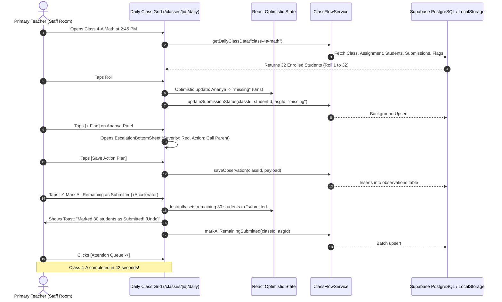
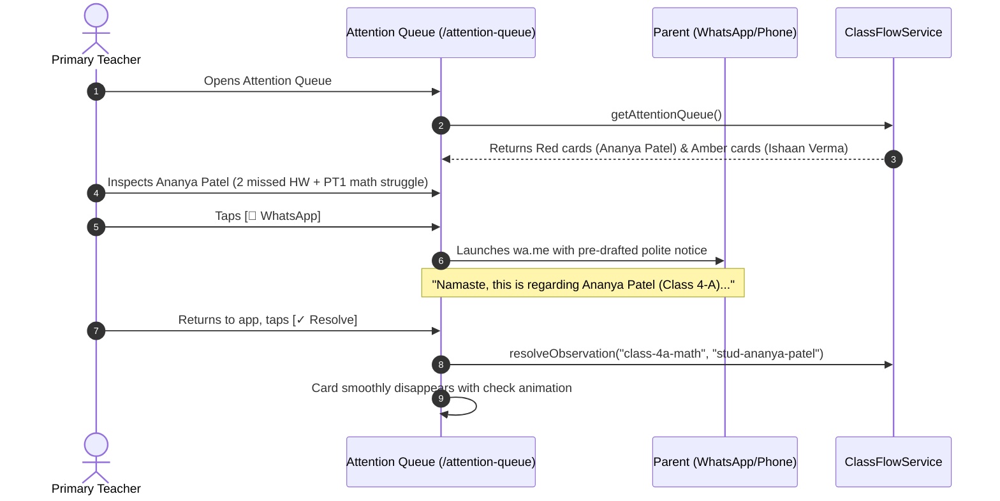

# ClassFlow — Full System Architecture, Data Engineering & Developer Integration Manual
**Document Version:** 3.0 (Academic Year 2026–2027 • 2026 Modern Standard)  
**Author:** Senior Backend Systems Architect & Full-Stack Platform Engineer (10+ Years Industry Experience)  
**Target Audience:** Full-Stack Engineers, AI Chatbot Developers, Agentic Workflow Engineers, Database Administrators, and Product Technical Leads  
**Repository Path:** [`f:/CU_Sudhanshu_File/SCSchool/Job Ready/Project/p`](file:///f:/CU_Sudhanshu_File/SCSchool/Job%20Ready/Project/p)

---

## Table of Contents
1. [Executive Architectural Summary & Operational Context](#1-executive-architectural-summary--operational-context)
2. [High-Level Topology & Technology Stack](#2-high-level-topology--technology-stack)
3. [Database Architecture & Complete Data Dictionary](#3-database-architecture--complete-data-dictionary)
4. [Service Layer & Dual-Mode Persistence Engine](#4-service-layer--dual-mode-persistence-engine)
5. [Frontend Architecture, Route Hierarchy & Component Taxonomy](#5-frontend-architecture-route-hierarchy--component-taxonomy)
6. [Interactive State Management & Optimistic UI Model](#6-interactive-state-management--optimistic-ui-model)
7. [End-to-End Execution Flows & Lifecycle Diagrams](#7-end-to-end-execution-flows--lifecycle-diagrams)
8. [AI Chatbot, LLM Agent & Automation Developer Playbook](#8-ai-chatbot-llm-agent--automation-developer-playbook)
9. [Developer Onboarding, Environment Setup & Maintenance](#9-developer-onboarding-environment-setup--maintenance)

---

## 1. Executive Architectural Summary & Operational Context

### 1.1 The Core Mission
ClassFlow is a high-velocity, deterministic teacher operating system and student intervention platform. It addresses one clear real-world problem:
> **“At the end of every school day (2:30 PM – 3:15 PM), a primary school teacher sitting in the staff room must log daily submissions, triage struggling students, and initiate targeted interventions in under 60–90 seconds per class.”**

### 1.2 Non-Negotiable Institutional Constraints
Every software engineer and AI model working on this codebase must adhere to these four operational facts:

1. **The "Zero Classroom Phone" Rule**:
   - Primary school teachers (Classes 1 to 6) in Indian schools (CBSE, ICSE, State Boards) are strictly prohibited from using smartphones in classrooms during instructional periods.
   - All logging occurs **post-dismissal** in the **Staff Room / Teacher's Lounge**.
   - Mobile UX demands: `100dvh` viewport containers, sticky action footers, and minimum **48px touch targets** (`touch-target-48`) for single-handed thumb operation.

2. **Dual Operational Persona (Teacher-First with Institutional Escalation)**:
   - **Current Focus (Individual Teacher SaaS)**: Self-service copilot for teachers of *any school and any subject*. Zero administrative bottlenecks; teachers own their classes, enroll students, and run daily logs independently.
   - **Institutional Extension (Coordinator Desk)**: Integrated governance portal for Primary Section Coordinators (e.g., *Mr. Rajesh Gupta*) to inspect cross-grade red flags, review diary notes, allocate remedial batches, and approve parent outreach.

3. **Deterministic Triage (Zero Hallucination Scoring)**:
   - Intervention priorities (🔴 High Red vs 🟡 Medium Amber) are calculated via **deterministic mathematical rules**, NOT opaque AI guesses.
   - Rule 1 (🔴 Red): $\ge 2$ consecutive missing homeworks OR active red-severity behavioral/academic flag.
   - Rule 2 (🟡 Amber): Exactly 1 missing homework OR active amber-severity flag OR quiz score $< 50\%$.
   - Rule 3 (🟢 Green): All recent work submitted, no open flags.

4. **Zero-Cost Document Generation**:
   - PTM summaries and class reports avoid heavy cloud PDF rendering services (Puppeteer, DocRaptor). Instead, they leverage browser-native `@media print` CSS engines for instantaneous, pixel-perfect 1-page A4 printing.

---

## 2. High-Level Topology & Technology Stack

```
┌────────────────────────────────────────────────────────────────────────────────┐
│                           CLIENT TIER (Mobile & Desktop)                       │
│  Next.js 16/15 (Turbopack) • React 19 • Tailwind CSS v4 • Lucide React 2026   │
└──────────────────────────────────────┬─────────────────────────────────────────┘
                                       │
                                       ▼
┌────────────────────────────────────────────────────────────────────────────────┐
│               ISOMORPHIC SERVICE ADAPTER (src/lib/supabase/service.ts)         │
│  - Auto-Detects Live Backend vs Demo/Offline Fallback                           │
│  - Optimistic In-Memory Mutation Pipeline                                       │
│  - LocalStorage Hybrid Persistence (`classflow_daily_*`, `classflow_classes_*`)│
└───────────────────────┬────────────────────────────────┬───────────────────────┘
                        │                                │
            (If .env.local exists)               (If Mock / Demo Mode)
                        ▼                                ▼
┌──────────────────────────────────────┐     ┌───────────────────────────────────┐
│     BACKEND PERSISTENCE TIER         │     │     BROWSER CLIENT CACHE          │
│  Supabase PostgreSQL 15+             │     │  LocalStorage + mock-data.ts      │
│  - Row-Level Security (RLS)          │     │  - Instant Zero-Config Bootstrapping│
│  - Deterministic Views (v_attention) │     │  - Full Offline Resilience        │
│  - RPC Aggregations (fn_ptm_report)  │     │  - Fast CI/CD and Demo Previews   │
└──────────────────────────────────────┘     └───────────────────────────────────┘
```

### 2.1 Technology Matrix
| Layer | Technology | Version / Standard | Architectural Role |
| :--- | :--- | :--- | :--- |
| **Framework** | Next.js App Router | `16.3.8` (Turbopack) | Server Components, Client Subtrees, Dynamic Routing |
| **Runtime** | React | `19.0.0` | `useTransition`, Optimistic UI, Action Dispatch |
| **Language** | TypeScript | `5.x` (Strict) | Static Typing, Shared DB Contracts, No Any |
| **Styling** | Tailwind CSS + PostCSS | `v4` (`@tailwindcss/postcss`) | Tokenized Modern Slate Theme, Dynamic Viewport Units (`dvh`) |
| **Icons** | Lucide React | `^1.16.0` | Accessible Micro-Iconography, Zero Layout Shift |
| **Database** | PostgreSQL / Supabase | `15+` / `@supabase/ssr` | Multi-Tenant RLS, Triggers, Views, RPC Functions |
| **Export Engine** | Browser Print Engine | Native CSS `@media print` | Zero-Cost 1-Page A4 Vector Reports & In-Memory CSV |

---

## 3. Database Architecture & Complete Data Dictionary

The persistence tier is defined in [`supabase_schema.sql`](file:///f:/CU_Sudhanshu_File/SCSchool/Job%20Ready/Project/p/supabase_schema.sql).

### 3.1 Entity-Relationship Diagram (Mermaid)

```mermaid
erDiagram
    STAFF ||--o{ CLASSES : "teaches / manages"
    STAFF ||--o{ OBSERVATIONS : "logs (as teacher)"
    STAFF ||--o{ OBSERVATIONS : "approves (as coordinator)"
    STAFF ||--o{ REPORT_EXPORTS : "generates"

    CLASSES ||--o{ ENROLLMENTS : "contains"
    STUDENTS ||--o{ ENROLLMENTS : "enrolled in"

    CLASSES ||--o{ ASSIGNMENTS : "assigns"
    CLASSES ||--o{ ASSESSMENTS : "conducts"
    CLASSES ||--o{ OBSERVATIONS : "context for"
    CLASSES ||--o{ REPORT_EXPORTS : "scoped to"

    ASSIGNMENTS ||--o{ SUBMISSIONS : "records"
    STUDENTS ||--o{ SUBMISSIONS : "submits"

    ASSESSMENTS ||--o{ ASSESSMENT_SCORES : "graded in"
    STUDENTS ||--o{ ASSESSMENT_SCORES : "receives"

    STUDENTS ||--o{ OBSERVATIONS : "subject of"
    STUDENTS ||--o{ REPORT_EXPORTS : "featured in"

    STAFF {
        uuid id PK "references auth.users.id"
        string email UK "not null"
        string full_name "not null"
        string role "teacher | coordinator | principal | admin"
        string school_name "default 'Primary Model School'"
        timestamptz created_at
    }

    CLASSES {
        uuid id PK "gen_random_uuid()"
        string name "e.g. 'Class 4-A'"
        int grade_level "1 to 6"
        string section "A, B, C"
        string subject "Mathematics, EVS, etc."
        uuid class_teacher_id FK "references staff.id"
        string academic_year "default '2026-2027'"
        timestamptz created_at
    }

    STUDENTS {
        uuid id PK "gen_random_uuid()"
        string admission_number UK "e.g. 'ADM-2026-101'"
        int roll_number "not null, e.g. 1"
        string first_name "not null"
        string last_name "not null"
        string father_name "optional"
        string mother_name "optional"
        string primary_contact "not null, parent phone/WhatsApp"
        timestamptz created_at
    }

    ENROLLMENTS {
        uuid id PK "gen_random_uuid()"
        uuid class_id FK "references classes.id ON DELETE CASCADE"
        uuid student_id FK "references students.id ON DELETE CASCADE"
        string academic_year "not null"
        timestamptz enrolled_at
    }

    ASSIGNMENTS {
        uuid id PK "gen_random_uuid()"
        uuid class_id FK "references classes.id ON DELETE CASCADE"
        string title "not null"
        text description
        string type "homework | classwork | project"
        date due_date "not null"
        timestamptz created_at
    }

    SUBMISSIONS {
        uuid id PK "gen_random_uuid()"
        uuid assignment_id FK "references assignments.id ON DELETE CASCADE"
        uuid student_id FK "references students.id ON DELETE CASCADE"
        string status "submitted | incomplete | missing | absent | pending"
        timestamptz logged_at
    }

    ASSESSMENTS {
        uuid id PK "gen_random_uuid()"
        uuid class_id FK "references classes.id ON DELETE CASCADE"
        string title "e.g. 'Periodic Test 1'"
        numeric max_marks "default 25.00"
        date assessment_date "not null"
        timestamptz created_at
    }

    ASSESSMENT_SCORES {
        uuid id PK "gen_random_uuid()"
        uuid assessment_id FK "references assessments.id ON DELETE CASCADE"
        uuid student_id FK "references students.id ON DELETE CASCADE"
        numeric marks_obtained
        boolean is_absent "default false"
        text remarks
    }

    OBSERVATIONS {
        uuid id PK "gen_random_uuid()"
        uuid student_id FK "references students.id ON DELETE CASCADE"
        uuid class_id FK "references classes.id ON DELETE CASCADE"
        uuid teacher_id FK "references staff.id"
        string category "academic | behavioral | incomplete_work | attendance | diary"
        string severity "amber | red"
        text teacher_note "not null"
        string action_type "Call Parent | WhatsApp Message | Assign Remedial Work | School Diary Note | 1-on-1 Counseling | Schedule PTM Slot"
        string status "todo | in_progress | resolved"
        string suggested_admin_action "legacy support"
        string admin_status "pending_review | approved | actioned_by_admin | rejected"
        text admin_feedback
        uuid approved_by FK "references staff.id"
        timestamptz created_at
        timestamptz actioned_at
    }

    REPORT_EXPORTS {
        uuid id PK "gen_random_uuid()"
        uuid teacher_id FK "references staff.id"
        uuid class_id FK "references classes.id"
        uuid student_id FK "references students.id, null for whole-class"
        string report_type "individual_ptm | class_consolidated"
        string timeframe "daily | weekly | monthly | custom"
        date start_date
        date end_date
        timestamptz exported_at
    }
```



### 3.2 Constraints & Key Indices
```sql
-- Uniqueness Guarantees
ALTER TABLE public.enrollments ADD CONSTRAINT uq_class_student_year UNIQUE (class_id, student_id, academic_year);
ALTER TABLE public.submissions ADD CONSTRAINT uq_assignment_student UNIQUE (assignment_id, student_id);
ALTER TABLE public.assessment_scores ADD CONSTRAINT uq_assessment_student UNIQUE (assessment_id, student_id);

-- Speedrun Performance Indices (Sub-10ms query execution)
CREATE INDEX idx_classes_teacher ON public.classes(class_teacher_id);
CREATE INDEX idx_enrollments_class ON public.enrollments(class_id);
CREATE INDEX idx_enrollments_student ON public.enrollments(student_id);
CREATE INDEX idx_assignments_class_due ON public.assignments(class_id, due_date);
CREATE INDEX idx_submissions_lookup ON public.submissions(assignment_id, student_id);
CREATE INDEX idx_observations_student_status ON public.observations(student_id, status);
CREATE INDEX idx_assessments_class ON public.assessments(class_id);
```

### 3.3 Row-Level Security (RLS) Protocol
All tables have `ENABLE ROW LEVEL SECURITY` active.

* **Teachers**: Limited to reading/writing classes where `class_teacher_id = auth.uid()` or where enrolled students belong to their classes.
* **Coordinators & Administrators**: Elevated privileges evaluated through the security definer function `public.is_admin_or_coordinator()`:
```sql
CREATE OR REPLACE FUNCTION public.is_admin_or_coordinator()
RETURNS BOOLEAN AS $$
BEGIN
    RETURN EXISTS (
        SELECT 1 FROM public.staff
        WHERE staff.id = auth.uid()
        AND staff.role IN ('coordinator', 'principal', 'admin')
    );
END;
$$ LANGUAGE plpgsql SECURITY DEFINER;
```

---

## 4. Service Layer & Dual-Mode Persistence Engine

The core data access abstraction lives in [`src/lib/supabase/service.ts`](file:///f:/CU_Sudhanshu_File/SCSchool/Job%20Ready/Project/p/src/lib/supabase/service.ts).

### 4.1 The Dual-Mode Adapter Pattern
To allow rapid local development, zero-config onboarding, and seamless production deployments:
```
           ┌────────────────────────────┐
           │   ClassFlowService API     │
           └─────────────┬──────────────┘
                         │
             isSupabaseConfigured() ?
             ┌───────────┴───────────┐
             │ YES                   │ NO
             ▼                       ▼
    [Live Supabase SDK]     [Browser LocalStorage Engine]
    - Direct PostgreSQL     - LocalStorage Key: `classflow_daily_*`
    - RLS Auth Header       - Seed fallback from `mock-data.ts`
    - Live Webhooks         - Instant Offline Zero-Lag Mutation
```

### 4.2 Key Service Method Contracts

```typescript
// 1. Roster & Class Management
ClassFlowService.getAllClasses(): Promise<ClassItem[]>
ClassFlowService.createClass(payload): Promise<ClassItem>
ClassFlowService.getNextRollNumber(classId): Promise<number>
ClassFlowService.addStudentsToClass(classId, students[]): Promise<DailyClassData>
ClassFlowService.updateStudentInClass(classId, studentId, updatedFields): Promise<DailyClassData>
ClassFlowService.removeStudentFromClass(classId, studentId): Promise<DailyClassData>

// 2. Daily Logging Grid (Sub-90s Accelerator)
ClassFlowService.getDailyClassData(classId): Promise<DailyClassData>
ClassFlowService.updateSubmissionStatus(classId, studentId, assignmentId, status): Promise<{ success: boolean }>
ClassFlowService.markAllRemainingSubmitted(classId, assignmentId): Promise<{ success: boolean; updatedCount: number }>

// 3. Observations & Attention Queue
ClassFlowService.saveObservation(classId, payload): Promise<{ success: boolean; observation: Observation }>
ClassFlowService.resolveObservation(classId, studentId): Promise<boolean>
ClassFlowService.getAttentionQueue(): Promise<AttentionQueueItem[]>

// 4. Reporting & Export Suite
ClassFlowService.getStudentPtmReport(studentId, classId?, timeframe?): Promise<StudentPtmReport>
ClassFlowService.getClassConsolidatedReport(classId): Promise<ClassConsolidatedRow[]>
```

---

## 5. Frontend Architecture, Route Hierarchy & Component Taxonomy

### 5.1 Route Map & Purpose
| Route Path | Render Strategy | Primary Purpose | Primary Component / File |
| :--- | :--- | :--- | :--- |
| `/` | Client Interactive | Teacher Command Center, Class Cards, New Class, Import Students | [`src/app/page.tsx`](file:///f:/CU_Sudhanshu_File/SCSchool/Job%20Ready/Project/p/src/app/page.tsx) |
| `/classes/[id]/daily` | Dynamic Client Route | The Rapid Daily Logging Grid (60s speedrun, 48px pills, flag drawer) | [`src/components/daily-grid/ClassDailyView.tsx`](file:///f:/CU_Sudhanshu_File/SCSchool/Job%20Ready/Project/p/src/components/daily-grid/ClassDailyView.tsx) |
| `/attention-queue` | Client Interactive | End-of-Day Teacher Triage (Red/Amber priority, 1-tap WhatsApp/Call, Resolve) | [`src/app/attention-queue/page.tsx`](file:///f:/CU_Sudhanshu_File/SCSchool/Job%20Ready/Project/p/src/app/attention-queue/page.tsx) |
| `/coordinator/review` | Client Interactive | Primary Section Coordinator Governance Desk (Cross-grade approvals, stamps) | [`src/app/coordinator/review/page.tsx`](file:///f:/CU_Sudhanshu_File/SCSchool/Job%20Ready/Project/p/src/app/coordinator/review/page.tsx) |
| `/students/[id]/ptm` | Client / Dynamic | 1-Page Vector Printable Student PTM Dossier (`@media print`, letterhead) | [`src/app/students/[id]/ptm/page.tsx`](file:///f:/CU_Sudhanshu_File/SCSchool/Job%20Ready/Project/p/src/app/students/%5Bid%5D/ptm/page.tsx) |
| `/classes/[id]/reports` | Client / Dynamic | Class-Wide Consolidated Ledger (Roll 1 to N, CSV export, Web Share API) | [`src/app/classes/[id]/reports/page.tsx`](file:///f:/CU_Sudhanshu_File/SCSchool/Job%20Ready/Project/p/src/app/classes/%5Bid%5D/reports/page.tsx) |

### 5.2 Component Taxonomy & Design Tokens

```
src/
├── app/
│   ├── layout.tsx             # Global layout, Geist fonts, viewport meta, MobileBottomNav mount
│   ├── globals.css            # Tailwind v4 theme directives, 48px tap targets, print CSS
│   ├── page.tsx               # Main Dashboard & Class Hub
│   ├── attention-queue/       # Triage & parent action deck
│   ├── coordinator/review/    # Institutional administrative approval cockpit
│   ├── students/[id]/ptm/     # 1-Page printable PTM dossier
│   └── classes/[id]/
│       ├── daily/             # Rapid logging grid entrypoint
│       └── reports/           # Class-wide ledger & export suite
├── components/
│   ├── common/
│   │   └── MobileBottomNav.tsx# Persistent thumb-zone bottom navigation bar (Home, Grid, Queue, Admin, Reports)
│   └── daily-grid/
│       ├── DailyGridHeader.tsx        # Class metadata, assignment due date, live completion pill
│       ├── AcceleratorBanner.tsx      # 1-Tap "Mark Remaining Submitted" + Undo buffer
│       ├── StatusCyclePill.tsx        # 48px cycle button: Submitted -> Incomplete -> Missing -> Absent
│       ├── StudentRowCard.tsx         # Monospace Roll No badge, student details, flag button, PTM quick-link
│       ├── EscalationBottomSheet.tsx  # Slide-up drawer for action tags, urgency level, notes, WhatsApp link
│       └── ClassRosterManagerModal.tsx# In-class student manager: Smart clipboard paste, single form, edit/delete
├── lib/
│   └── supabase/
│       ├── client.ts          # Browser Supabase client instantiation
│       ├── server.ts          # Next.js Server Components / Action Supabase client
│       ├── mock-data.ts       # Realistic Indian primary school fallback seed dataset
│       └── service.ts         # Dual-mode persistence layer & business logic
└── types/
    └── database.ts            # Canonical domain TypeScript definitions
```

---

## 6. Interactive State Management & Optimistic UI Model

### 6.1 The 90-Second Speedrun Optimistic Architecture
In a school staff room with spotty Wi-Fi, waiting 800ms for a network roundtrip on every tap is unacceptable. ClassFlow uses an **Optimistic Memory Mutation with Background Reconcile** model:

```
[ Teacher Taps Status Pill: Aarav Sharma -> Missing ]
                         │
                         ├─► 1. Local State Mutates Instantly (0ms latency, UI updates color/icon)
                         ├─► 2. Summary Counters recalculate synchronously
                         ├─► 3. React `startTransition` queues background network sync:
                         │      - If Supabase: `supabase.from('submissions').upsert(...)`
                         │      - If Mock: `localStorage.setItem('classflow_daily_...', ...)`
                         └─► 4. On Error: Reverts state and surfaces toast notification.
```

### 6.2 The Batch Accelerator & Undo Buffer
When the teacher taps `[✓ Mark All Remaining as Submitted]`:
1. The entire previous class state snapshot is copied into `previousStates`.
2. All students with `status === 'pending'` or `status !== 'submitted'` are immediately mutated to `'submitted'`.
3. A floating Toast appears with a **1-click "Undo" button**.
4. Tapping "Undo" rolls back the snapshot completely with zero data loss.

### 6.3 Smart Clipboard Roster Parser Regex Engine
In [`ClassRosterManagerModal.tsx`](file:///f:/CU_Sudhanshu_File/SCSchool/Job%20Ready/Project/p/src/components/daily-grid/ClassRosterManagerModal.tsx), teachers can copy-paste rosters from Excel or WhatsApp. The regex sanitizer automatically parses messy inputs:
* Handles `1, Aarav Sharma, 9811122331, Vivek Sharma`
* Handles `1. Aarav Sharma` (auto-generates standard ADM number & dummy contact)
* Handles tab-separated Excel rows (`\t`)
* Auto-increments roll numbers starting from `MAX(current_rolls) + 1`

---

## 7. End-to-End Execution Flows & Lifecycle Diagrams

### Flow A: The Post-Dismissal Class Speedrun (60–90 Seconds)


---

### Flow B: Attention Queue Triage & Direct Parent Action


---

## 8. AI Chatbot, LLM Agent & Automation Developer Playbook

ClassFlow is engineered to be **Agent-Native**. An AI Chatbot or LLM agent (Antigravity, OpenAI GPT-4o, Claude 3.5 Sonnet, Gemini 1.5 Pro) can interface with ClassFlow as an autonomous teaching assistant.

### 8.1 Core Principles for AI Chatbot Developers
1. **Never Hallucinate Attendance or Marks**: Any AI bot answering parents or teachers must query `ClassFlowService` directly via structured tools.
2. **Context Window Injection**: Always inject the student's **Roll Number**, **Class Name**, **Subject**, and **Last 3 Submissions** into the system prompt.
3. **Tone Guidelines**: In Indian primary school contexts, communication with parents must always begin with a respectful greeting (*"Namaste / Dear Parent"*), state the exact observation objectively, and offer supportive next steps (*"Please review tonight with the student"*).

### 8.2 Standardized JSON Tool Definitions (OpenAI / Claude / Gemini Function Calling)

Below are the production schemas for AI Agent integration:

#### Tool 1: `query_student_status`
```json
{
  "name": "query_student_status",
  "description": "Retrieves the academic consistency, homework submission rate, recent missing tasks, and active flags for a student.",
  "parameters": {
    "type": "object",
    "properties": {
      "student_id": {
        "type": "string",
        "description": "The unique UUID or ID of the student (e.g., 'stud-ananya-patel')."
      },
      "class_id": {
        "type": "string",
        "description": "The class ID (e.g., 'class-4a-math')."
      },
      "timeframe": {
        "type": "string",
        "enum": ["daily", "weekly", "monthly"],
        "description": "The review period window."
      }
    },
    "required": ["student_id"]
  }
}
```

#### Tool 2: `log_rapid_intervention`
```json
{
  "name": "log_rapid_intervention",
  "description": "Logs an academic or behavioral intervention flag for a student and schedules an action item (e.g. Call Parent, Remedial Practice).",
  "parameters": {
    "type": "object",
    "properties": {
      "class_id": { "type": "string" },
      "student_id": { "type": "string" },
      "severity": {
        "type": "string",
        "enum": ["amber", "red"],
        "description": "Use 'red' for 2+ missed homeworks or severe issues; 'amber' for minor struggles."
      },
      "category": {
        "type": "string",
        "enum": ["academic", "behavioral", "incomplete_work", "attendance", "diary"]
      },
      "action_type": {
        "type": "string",
        "enum": ["Call Parent", "WhatsApp Message", "Assign Remedial Work", "School Diary Note", "1-on-1 Counseling", "Schedule PTM Slot"]
      },
      "teacher_note": {
        "type": "string",
        "description": "Objective observation note explaining the problem."
      }
    },
    "required": ["class_id", "student_id", "severity", "category", "action_type", "teacher_note"]
  }
}
```

#### Tool 3: `draft_parent_whatsapp_notice`
```json
{
  "name": "draft_parent_whatsapp_notice",
  "description": "Drafts an official, polite WhatsApp notification for a parent regarding homework deficits or praise.",
  "parameters": {
    "type": "object",
    "properties": {
      "student_name": { "type": "string" },
      "class_name": { "type": "string" },
      "subject": { "type": "string" },
      "issue_summary": { "type": "string" },
      "action_required": { "type": "string" }
    },
    "required": ["student_name", "class_name", "subject", "issue_summary"]
  }
}
```

### 8.3 Recommended AI Chatbot System Prompt (Example)

```markdown
You are ClassFlow Copilot, an intelligent teaching assistant supporting primary teachers in Indian schools (Classes 1 to 6).
Your job is to help teachers log end-of-day work quickly, summarize student deficits, and draft polite, professional parent communications.

Rules:
1. Always address students by their Roll Number and Name (e.g., "Roll #02 Ananya Patel").
2. When a student misses 2 or more consecutive tasks, label this as "🔴 HIGH PRIORITY".
3. When drafting WhatsApp messages to parents:
   - Start with "Namaste" or "Dear Parent of [Student Name]".
   - State the class, subject, and the exact pending homework.
   - Maintain a supportive, encouraging, and constructive tone.
   - Keep messages under 60 words for quick reading on mobile phones.
4. Never make up scores or submission records. Always call `query_student_status` before answering questions about a student's performance.
```

---

## 9. Developer Onboarding, Environment Setup & Maintenance

### 9.1 Quick Start (Zero-Config Mock Mode)
You do **not** need a Supabase database running to test or develop on ClassFlow. The project ships with an embedded mock persistence engine:

```bash
# 1. Clone repository & install dependencies
npm install

# 2. Start the Turbopack development server
npm run dev

# 3. Access in browser
# Open: http://localhost:3000
```

### 9.2 Switching to Live Supabase Backend
When ready to connect to a live Supabase PostgreSQL instance:
1. Create a free Supabase project at [supabase.com](https://supabase.com).
2. Open the Supabase **SQL Editor** and execute [`supabase_schema.sql`](file:///f:/CU_Sudhanshu_File/SCSchool/Job%20Ready/Project/p/supabase_schema.sql).
3. (Optional) Run [`seed_data.sql`](file:///f:/CU_Sudhanshu_File/SCSchool/Job%20Ready/Project/p/seed_data.sql) to populate realistic test data.
4. Create `.env.local` in the project root:
   ```env
   NEXT_PUBLIC_SUPABASE_URL=https://your-project-id.supabase.co
   NEXT_PUBLIC_SUPABASE_ANON_KEY=eyJhbGciOiJIUzI1NiIsInR5cCI6IkpXVCJ9...
   ```
5. Restart `npm run dev`. The application header will instantly show `● Live Supabase` with active RLS!

### 9.3 Build Verification & Production Bundling
Always verify TypeScript compilation and Turbopack page optimization before committing:
```bash
npm run build
```
Expected output:
```
Route (app)
┌ ○ /
├ ○ /_not-found
├ ○ /attention-queue
├ ○ /coordinator/review
├ ƒ /classes/[id]/daily
├ ƒ /classes/[id]/reports
└ ƒ /students/[id]/ptm
✓ Compiled successfully
```

---

## 10. Summary & Sign-off

This document represents the complete technical source of truth for **ClassFlow**. Any human engineer or AI development agent reviewing this specification has full visibility into:
* The exact database schema, keys, and RLS policies.
* The dual-mode client/server service architecture.
* The mobile-first design tokens and 60-second logging state machine.
* The deterministic mathematical scoring engine for interventions.
* The ready-to-wire tool definitions for AI Chatbot integration.
