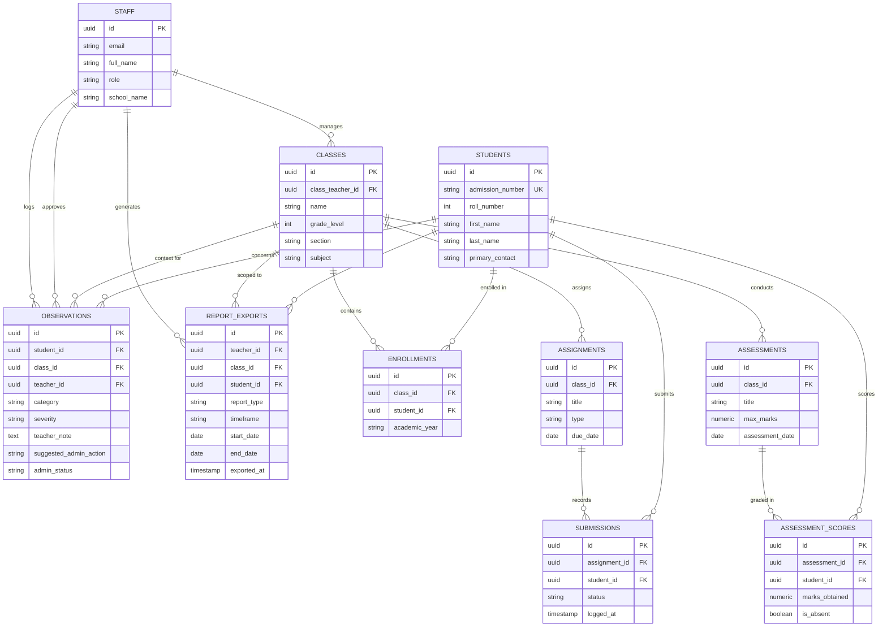

# ClassFlow — Entity Relationship Diagram (ERD) & Database Specification (Teacher Edition)

Tailored as a **Personal Teacher Assistant / Daily Copilot (Any School & Any Subject)**:
- **Individual Teacher-First**: Self-service workspace owned by the teacher (`teacher_id = auth.uid()`), with zero administrative bottlenecks or approval delays.
- **Multi-Class & Multi-Subject**: Flexible setup for any school name, subject, or grading framework.
- **Fast Student Onboarding**: Single entry form and bulk CSV/Excel/Text copy-paste parser.
- **Personal Attention Queue**: Real-time deterministic triage (🔴 Red / 🟡 Amber) with 1-tap WhatsApp message, phone call, and resolution tracking.
- **Reporting & Export Suite**: Individual Student PTM Dossier (Daily, Weekly, Monthly) + Whole Class Consolidated Ledger with Save (PDF/Excel) & Share capabilities.

---

## 1. Domain Entities & Database Schema

### 1.1 `profiles` / `staff` (extends Supabase `auth.users`)
- `id` (UUID, Primary Key, references `auth.users.id`)
- `email` (TEXT, unique, not null)
- `full_name` (TEXT, not null, e.g. "Mrs. Sunita Sharma")
- `role` (TEXT, not null — `'teacher' | 'coordinator' | 'principal' | 'admin'`)
- `school_name` (TEXT, not null)
- `created_at` (TIMESTAMPTZ, default `now()`)

### 1.2 `classes` (e.g. Class 3-B, Class 5-A)
- `id` (UUID, Primary Key, default `gen_random_uuid()`)
- `name` (TEXT, not null, e.g. "Class 5-A")
- `grade_level` (INT, not null — `1` to `6`)
- `section` (TEXT, not null, e.g. "A", "B", "C")
- `subject` (TEXT, not null, e.g. "Mathematics", "English", "EVS")
- `class_teacher_id` (UUID, Foreign Key → `staff.id`)
- `academic_year` (TEXT, default '2026-2027')
- `created_at` (TIMESTAMPTZ, default `now()`)

### 1.3 `students`
- `id` (UUID, Primary Key, default `gen_random_uuid()`)
- `admission_number` (TEXT, unique, not null, e.g. "ADM-2026-1042")
- `roll_number` (INT, not null, e.g. `12`)
- `first_name` (TEXT, not null)
- `last_name` (TEXT, not null)
- `father_name` (TEXT, optional)
- `mother_name` (TEXT, optional)
- `primary_contact` (TEXT, not null, e.g. "+91 9876543210")
- `created_at` (TIMESTAMPTZ, default `now()`)

### 1.4 `enrollments` (Class ↔ Student Mapping)
- `id` (UUID, Primary Key, default `gen_random_uuid()`)
- `class_id` (UUID, Foreign Key → `classes.id` ON DELETE CASCADE)
- `student_id` (UUID, Foreign Key → `students.id` ON DELETE CASCADE)
- `academic_year` (TEXT, default '2026-2027')
- *Unique Constraint*: `(class_id, student_id, academic_year)`

### 1.5 `assignments` (Daily Homework / Classwork)
- `id` (UUID, Primary Key, default `gen_random_uuid()`)
- `class_id` (UUID, Foreign Key → `classes.id` ON DELETE CASCADE)
- `title` (TEXT, not null, e.g. "Chapter 4: Multiplication Table of 7")
- `type` (TEXT, default 'homework' — `'homework' | 'classwork' | 'project'`)
- `due_date` (DATE, not null)
- `created_at` (TIMESTAMPTZ, default `now()`)

### 1.6 `submissions` (Rapid Post-Dismissal Entry)
- `id` (UUID, Primary Key, default `gen_random_uuid()`)
- `assignment_id` (UUID, Foreign Key → `assignments.id` ON DELETE CASCADE)
- `student_id` (UUID, Foreign Key → `students.id` ON DELETE CASCADE)
- `status` (TEXT, not null, default 'pending' — `'submitted' | 'incomplete' | 'missing' | 'absent'`)
- `logged_at` (TIMESTAMPTZ, default `now()`)
- *Unique Constraint*: `(assignment_id, student_id)`

### 1.7 `assessments` (Unit Tests / Periodic Tests)
- `id` (UUID, Primary Key, default `gen_random_uuid()`)
- `class_id` (UUID, Foreign Key → `classes.id` ON DELETE CASCADE)
- `title` (TEXT, not null, e.g. "Periodic Test 1", "Mental Math Unit Quiz")
- `max_marks` (NUMERIC(5,2), not null, default 25.00)
- `assessment_date` (DATE, not null)
- `created_at` (TIMESTAMPTZ, default `now()`)

### 1.8 `assessment_scores`
- `id` (UUID, Primary Key, default `gen_random_uuid()`)
- `assessment_id` (UUID, Foreign Key → `assessments.id` ON DELETE CASCADE)
- `student_id` (UUID, Foreign Key → `students.id` ON DELETE CASCADE)
- `marks_obtained` (NUMERIC(5,2))
- `is_absent` (BOOLEAN, default false)
- `remarks` (TEXT, optional)
- *Unique Constraint*: `(assessment_id, student_id)`

### 1.9 `observations` (Flags & Admin Escalations)
- `id` (UUID, Primary Key, default `gen_random_uuid()`)
- `student_id` (UUID, Foreign Key → `students.id` ON DELETE CASCADE)
- `class_id` (UUID, Foreign Key → `classes.id` ON DELETE CASCADE)
- `teacher_id` (UUID, Foreign Key → `staff.id`, not null)
- `category` (TEXT, not null — `'academic' | 'behavioral' | 'incomplete_work' | 'attendance'`)
- `severity` (TEXT, not null — `'amber' | 'red'`)
- `teacher_note` (TEXT, not null)
- `suggested_admin_action` (TEXT, not null — `'Recommend Parent Call' | 'Recommend Remedial Class' | 'Recommend Official Diary Note' | 'Request PTM Slot'`)
- `admin_status` (TEXT, not null, default 'pending_review' — `'pending_review' | 'approved' | 'actioned_by_admin' | 'rejected'`)
- `admin_feedback` (TEXT, optional)
- `approved_by` (UUID, Foreign Key → `staff.id`, optional)
- `created_at` (TIMESTAMPTZ, default `now()`)
- `actioned_at` (TIMESTAMPTZ, optional)

### 1.10 `report_exports` (Audit & Export History)
- `id` (UUID, Primary Key, default `gen_random_uuid()`)
- `teacher_id` (UUID, Foreign Key → `staff.id`, not null)
- `class_id` (UUID, Foreign Key → `classes.id`, not null)
- `student_id` (UUID, Foreign Key → `students.id`, optional — NULL for whole class report)
- `report_type` (TEXT, not null — `'individual_ptm' | 'class_consolidated'`)
- `timeframe` (TEXT, not null — `'daily' | 'weekly' | 'monthly' | 'custom'`)
- `start_date` (DATE, not null)
- `end_date` (DATE, not null)
- `exported_at` (TIMESTAMPTZ, default `now()`)

---

## 2. Mermaid Entity Relationship Diagram



---

## 3. Database Reporting Functions (Aggregations)

### 3.1 Individual Student Timeframe PTM Aggregation
A parameterized PostgreSQL function `fn_student_ptm_report(p_student_id, p_start_date, p_end_date)` returns:
- **Homework Stats**: Total assignments, completed count, missing count, completion rate (`%`).
- **Assessment Stats**: Periodic tests taken, total marks obtained vs max marks, average score (`%`).
- **Flags & Observations**: All logged flags in the window, teacher notes, and coordinator status.

### 3.2 Class-Wide Consolidated Ledger Aggregation
A parameterized PostgreSQL function `fn_class_consolidated_report(p_class_id, p_start_date, p_end_date)` returns rows for all enrolled students in the class sorted by **Roll Number**:
```sql
SELECT
  s.roll_number,
  s.first_name || ' ' || s.last_name AS student_name,
  s.admission_number,
  COUNT(sub.id) AS total_assignments,
  COUNT(CASE WHEN sub.status = 'submitted' THEN 1 END) AS submitted_count,
  ROUND(
    COUNT(CASE WHEN sub.status = 'submitted' THEN 1 END)::NUMERIC / 
    NULLIF(COUNT(sub.id), 0) * 100, 1
  ) AS hw_completion_pct,
  COALESCE(AVG(sc.marks_obtained / NULLIF(a.max_marks, 0) * 100), 0) AS avg_test_pct,
  COUNT(CASE WHEN obs.severity = 'red' THEN 1 END) AS red_flag_count,
  COUNT(CASE WHEN obs.severity = 'amber' THEN 1 END) AS amber_flag_count,
  CASE 
    WHEN COUNT(CASE WHEN obs.severity = 'red' THEN 1 END) > 0 OR 
         (COUNT(sub.id) - COUNT(CASE WHEN sub.status = 'submitted' THEN 1 END)) >= 2 
    THEN 'High Attention'
    WHEN COUNT(CASE WHEN obs.severity = 'amber' THEN 1 END) > 0 OR 
         (COUNT(sub.id) - COUNT(CASE WHEN sub.status = 'submitted' THEN 1 END)) = 1 
    THEN 'Monitor'
    ELSE 'On Track'
  END AS intervention_status
FROM enrollments e
JOIN students s ON s.id = e.student_id
LEFT JOIN assignments asg ON asg.class_id = e.class_id AND asg.due_date BETWEEN p_start_date AND p_end_date
LEFT JOIN submissions sub ON sub.assignment_id = asg.id AND sub.student_id = s.id
LEFT JOIN assessments a ON a.class_id = e.class_id AND a.assessment_date BETWEEN p_start_date AND p_end_date
LEFT JOIN assessment_scores sc ON sc.assessment_id = a.id AND sc.student_id = s.id
LEFT JOIN observations obs ON obs.student_id = s.id AND obs.class_id = e.class_id AND obs.created_at::DATE BETWEEN p_start_date AND p_end_date
WHERE e.class_id = p_class_id
GROUP BY s.id, s.roll_number, s.first_name, s.last_name, s.admission_number
ORDER BY s.roll_number ASC;
```

---

## 4. Row-Level Security (RLS) Protocol

- Teachers can only generate and export reports for classes assigned to them.
- Coordinators and Principals have unrestricted export rights across all primary grades (1–6).
